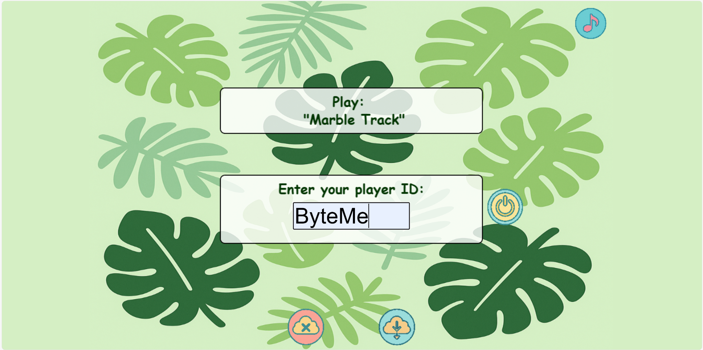

# Early Learning Lab: Gamified Research Platform (Marble Track)

## 🎯 Project Overview
Developed for the **Early Learning Lab (UoA School of Psychology)**, this project digitalizes cognitive research tasks into an engaging 2D game platform. As the Lead PM, I ensured the transition from physical observation to digital data collection was seamless, reliable, and child-centric.

### 🏆 My Role: Project Manager & UI Designer
**Team 21 Lead:** I orchestrated the end-to-end delivery of the "Marble Track" and "Apple Catcher" modules, managing the full SDLC within a 15-week Agile framework.

---

## 🎨 UI/UX Design Philosophy & Innovation
I led the visual identity of the platform, ensuring it balanced academic rigor with child-friendly engagement.

### 🌿 Jungle-Themed Engagement
- **Thematic Consistency:** Designed a vibrant "Jungle" theme to reduce child anxiety during assessments and increase task persistence.
- **UI Fundamentals:** Strictly adhered to UI principles including **Visual Hierarchy** (directing attention to the Marble), **Consistency** (unified button styles), and **Accessibility** (high-contrast elements for young users).
- **Interactive Feedback:** Engineered a **Randomized Firework Celebration Script** on the results page. Using Phaser's particle system, I implemented a logic that triggers multi-colored fireworks to reward children, reinforcing positive reinforcement in cognitive testing.

| 1. Player Login | 2. Core Gameplay | 3. Reward (Fireworks) |
| :---: | :---: | :---: |
|  |  |  |
| *Intuitive ID Entry* | *Physics-based Learning* | *Custom Particle Celebration* |

---

## 🛠️ Project Management (PM) Deep Dive
I applied professional management methodologies to ensure the project’s success:

### 1. Agile Orchestration & Sprint Control
- **Sprint Management:** Led 15 weekly sprints, using **GitHub Projects** as a Kanban board to track 50+ user stories and technical tasks.
- **Risk Mitigation:** Proactively identified bottlenecks in the physics engine integration (Matter-js) and reallocated developer resources to maintain the timeline.

### 2. Stakeholder & Requirement Engineering
- **Requirement Translation:** Acted as the primary liaison with the School of Psychology. I translated complex psychological research protocols into clear, actionable **Use Case Diagrams** and Technical Requirements for the dev team.
- **Data Integrity Oversight:** Defined the specifications for the **Data Logging System**, ensuring precise capture of timestamps, retry counts, and coordinate data for subsequent research analysis.

### 3. Quality Assurance & Documentation
- **Technical Writing:** Authored the comprehensive **Final Project Report**, detailing system architecture, testing phases, and ethical considerations for human-participant research software.

---

## 🏗️ Tech Stack
- **Game Engine:** Phaser 3.60 (TypeScript)
- **Physics:** Matter-js
- **Project Tools:** GitHub Actions (CI/CD), Trello/GitHub Projects, Figma (UI Mockups)

## 📂 Project Resources
- 📄 [**Read the Final Project Report (PDF)**](./docs/COMPSCI_399_Final_Report.pdf)
- 🎥 [**Gameplay Demo Video**](https://drive.google.com/file/d/14FbGy_pvA-B83W9AbcC-rixacvAA6p3i/view?usp=sharing)

---
*Developed by Team 21 - Fei Lan (PM/UI Lead), Jervid Cheng, Sophia Zhang, Linh Ha, Yiqing Cheng, Shuxuan Huang.*
